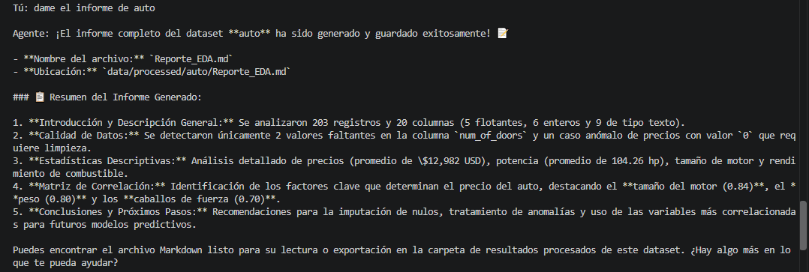
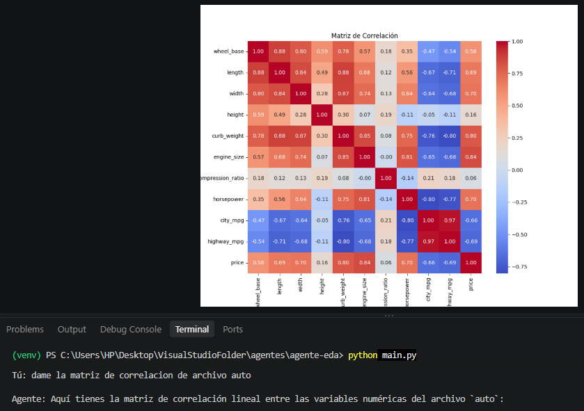
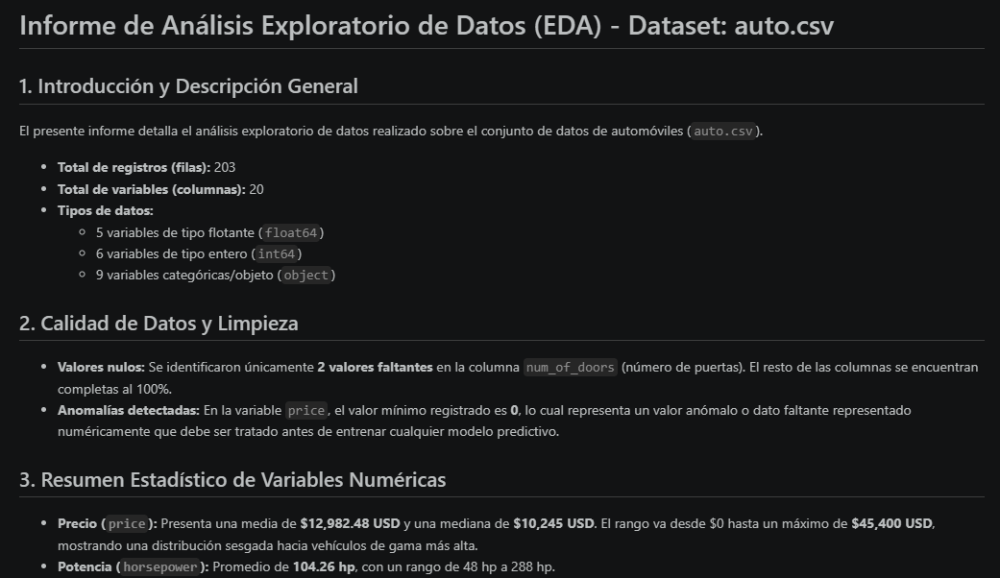

# Agente Autónomo de Análisis Exploratorio de Datos (EDA)


Un asistente conversacional de consola que actúa como un analista de datos autónomo. Utilizando **function calling** nativo con el SDK de Google (`google-genai`), el agente recibe instrucciones en lenguaje natural, razona sobre el contexto y decide qué herramientas de Python ejecutar para extraer *insights* de archivos CSV y Excel.

## Propuesta de valor

A diferencia de pedirle a un LLM genérico que "analice datos" (lo cual a menudo genera alucinaciones si no tiene acceso real al archivo), este agente **ejecuta código pandas real** sobre tu dataset. Las estadísticas, correlaciones y gráficos provienen de cálculos matemáticos precisos; el rol de la IA es orquestar las herramientas y explicar los hallazgos, no inventar los números.

- **Para el usuario:** revisión panorámica e inmediata de un dataset nuevo, sin escribir código de EDA repetitivo.
- **A nivel de ingeniería:** demuestra el diseño de herramientas (`skills`) para un LLM, manejo de estado de sesión, aislamiento de artefactos por dataset, y un ejercicio deliberado de documentar dónde el modelo sí puede fallar — en vez de ocultarlo.


### **Ejemplo de ejecución en terminal** ###



## Características principales

- **Carga de datos flexible:** archivos `.csv` y `.xlsx`, incluyendo selección de hoja específica en Excel con múltiples pestañas.
- **Análisis estadístico:** medidas de tendencia central, detección de nulos y matriz de correlación lineal.
- **Visualización automatizada:** histogramas y mapas de calor (`.png`), generados con un backend *headless* de Matplotlib para operar también en entornos sin GUI.
- **Análisis "de un clic" (`run_full_eda`):** evalúa la varianza de las columnas numéricas para graficar solo las más relevantes, entregando información general, estadísticas, nulos, correlación y gráficos en una sola respuesta.
- **Aislamiento por dataset:** cada archivo cargado genera su propia subcarpeta en `data/processed/<nombre_dataset>/`, evitando que los artefactos de un dataset sobrescriban a los de otro.
- **Manejo de errores controlado:** archivos inexistentes, columnas de texto enviadas a gráficos numéricos, hojas de Excel inválidas o correlaciones sin suficientes columnas numéricas devuelven mensajes claros sin interrumpir la sesión.

### **Ejemplo de solicitud y generación de gráfico de correlación** ###



### **Ejemplo de informe generado** ###




## Arquitectura del proyecto

La arquitectura separa estrictamente las responsabilidades:

- `skills.py`: lógica pura de análisis de datos (no sabe nada de IA).
- `agent.py`: cerebro orquestador (configura el cliente y las *tools* de Gemini).
- `main.py`: interfaz de usuario (bucle interactivo de consola).

```text
Agente_EDA/
├── data/
│   ├── raw/            # Datasets de entrada (protegidos en .gitignore)
│   └── processed/      # Entregables generados, subcarpetas por dataset
├── .env.example        # Plantilla de variables de entorno
├── .gitignore          # Reglas de exclusión (protege datos y API keys)
├── requirements.txt    # Dependencias del proyecto
├── skills.py           # Herramientas atómicas (pandas, seaborn)
├── agent.py            # Configuración del LLM (google-genai)
└── main.py             # Bucle interactivo de consola
```

## Instalación y uso

**1. Clonar el repositorio**
```bash
git clone <https://github.com/CristianRiquelmeF/Agente-Autonomo-EDA>
cd Agente_EDA
```

**2. Crear y activar un entorno virtual**
```bash
python -m venv venv
# Windows:
venv\Scripts\activate
# Mac/Linux:
source venv/bin/activate
```

**3. Instalar dependencias**
```bash
pip install -r requirements.txt
```

**4. Configurar credenciales**

Copia `.env.example` a `.env` y reemplaza el valor con tu clave real:
```bash
cp .env.example .env
```
```
GEMINI_API_KEY=tu_clave_aqui
```

**5. Ejecución**

Coloca tus archivos CSV o Excel en `data/raw/` y ejecuta:
```bash
python main.py
```

## Ejemplos de interacción

- "¿Qué archivos tengo disponibles para analizar?"
- "Carga ventas.xlsx"
- "Dame los estadísticos descriptivos"
- "Grafica un histograma del precio"
- "Ejecuta un análisis rápido"
- "Redacta un informe final en Markdown con los hallazgos"

## Consideraciones y casos límite

Este proyecto fue probado deliberadamente contra sus propios puntos débiles. Documentar estas barreras es parte de la madurez del diseño, no un defecto oculto:

- **Rechazo controlado por el modelo:** el LLM puede negarse a ejecutar una herramienta si el contexto no lo amerita (ej. pedir un histograma de una columna de texto), explicando por qué en vez de intentarlo. Esto evidencia razonamiento previo a la ejecución — la validación interna en `skills.py` actúa como respaldo, pero en la práctica el modelo suele adelantarse.
- **El modelo puede inventar contexto que no está en los datos:** en pruebas reales, al describir la columna `engine_size` el agente asignó por su cuenta una unidad de medida ("cc/ci") que no existe en ninguna parte del dataset ni fue indicada por el usuario. Los cálculos numéricos son siempre reales; las interpretaciones en lenguaje natural del modelo deben revisarse con criterio.
- **Estado en memoria de sesión única:** la retención del DataFrame y del cliente HTTP está pensada para una sesión interactiva individual, no para concurrencia de múltiples usuarios simultáneos.
- **Seguridad de rutas:** el código usa `os.path.basename` para mitigar path traversal, impidiendo que la IA o el usuario lean/escriban fuera de `data/raw/` y `data/processed/`. No es un sandbox completo ni está pensado para exponerse a usuarios no confiables en producción.
- **Sobrescritura intencional:** recargar el mismo dataset y pedir un nuevo gráfico o reporte sobrescribe la versión anterior dentro de su propia subcarpeta — es el comportamiento esperado para un flujo de trabajo iterativo, no un bug.

---

## Autor

Cristian Riquelme — [GitHub: CristianRiquelmeF](https://github.com/CristianRiquelmeF)
Sociólogo y Analista de Datos/BI.
